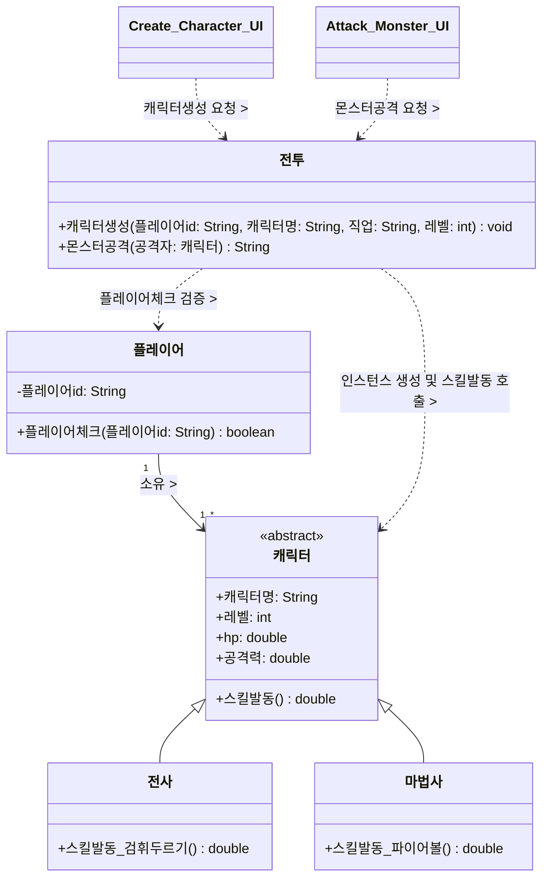

```mermaid
classDiagram
    direction ISO

    %% UI Boundary Classes
    class Create_Character_UI {

    }

    class Attack_Monster_UI {

    }

    %% Control Class (요구사항 반영: 행위로 캐릭터생성, 몬스터공격 포함)
    class 전투 {
        +캐릭터생성(플레이어id: String, 캐릭터명: String, 직업: String, 레벨: int) void
        +몬스터공격(공격자: 캐릭터) String
    }

    %% Domain Classes
    class 플레이어 {
        -플레이어id: String
        +플레이어체크(플레이어id: String) boolean
    }

    class 캐릭터 {
        <<abstract>>
        +캐릭터명: String
        +레벨: int
        +hp: double
        +공격력: double
        +스킬발동() double
    }

    class 전사 {
        +스킬발동_검휘두르기() double
    }

    class 마법사 {
        +스킬발동_파이어볼() double
    }

    %% Relationships
    %% 1. 상속 및 소유 관계
    캐릭터 <|-- 전사
    캐릭터 <|-- 마법사
    플레이어 "1" --> "1..*" 캐릭터 : 소유 >

    %% 2. UI와 전투 클래스의 상호작용
    Create_Character_UI ..> 전투 : 캐릭터생성 요청 >
    Attack_Monster_UI ..> 전투 : 몬스터공격 요청 >

    %% 3. 전투 클래스의 비즈니스 로직 처리 (include 및 연산 수반)
    전투 ..> 플레이어 : 플레이어체크 검증 >
    전투 ..> 캐릭터 : 인스턴스 생성 및 스킬발동 호출 >
```
