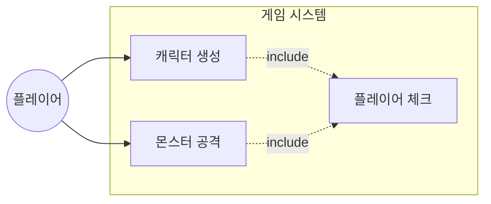

```mermaid
graph LR
    %% 액터 정의
     플레이어((플레이어))

    %% 시스템 경계 및 사용사례 정의
    subgraph  게임 시스템
        캐릭터생성["캐릭터 생성"]
        몬스터공격["몬스터 공격"]
        플레이어체크["플레이어 체크"]
    end

    %% 관계 설정 (연관 관계)
    플레이어 --> 캐릭터생성
    플레이어 --> 몬스터공격

    %% 관계 설정 (포함 관계)
    캐릭터생성 -.->|include| 플레이어체크
    몬스터공격 -.->|include| 플레이어체크
```
