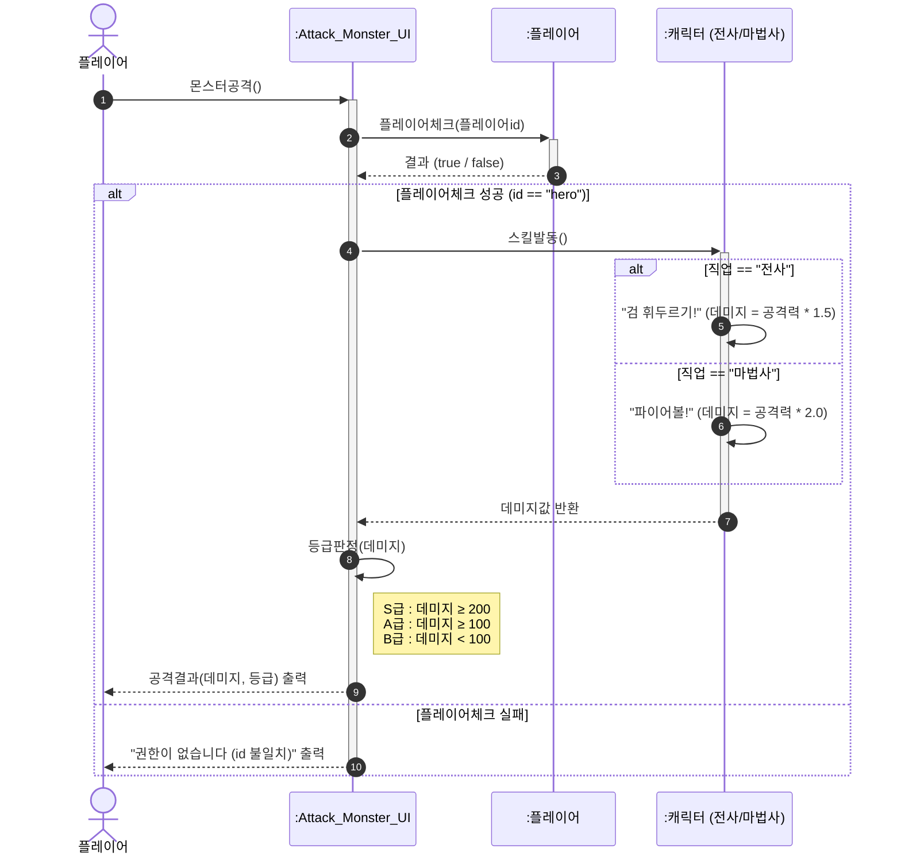

```mermaid
sequenceDiagram
    autonumber
    actor U as 플레이어
    participant UI as :Attack_Monster_UI
    participant P as :플레이어
    participant C as :캐릭터 (전사/마법사)

    U->>+UI: 몬스터공격()
    UI->>+P: 플레이어체크(플레이어id)
    P-->>-UI: 결과 (true / false)

    alt 플레이어체크 성공 (id == "hero")
        UI->>+C: 스킬발동()
        alt 직업 == "전사"
            C->>C: "검 휘두르기!" (데미지 = 공격력 * 1.5)
        else 직업 == "마법사"
            C->>C: "파이어볼!" (데미지 = 공격력 * 2.0)
        end
        C-->>-UI: 데미지값 반환
        UI->>UI: 등급판정(데미지)
        Note right of UI: S급 : 데미지 ≥ 200<br/>A급 : 데미지 ≥ 100<br/>B급 : 데미지 < 100
        UI-->>U: 공격결과(데미지, 등급) 출력
    else 플레이어체크 실패
        UI-->>-U: "권한이 없습니다 (id 불일치)" 출력
    end
```
