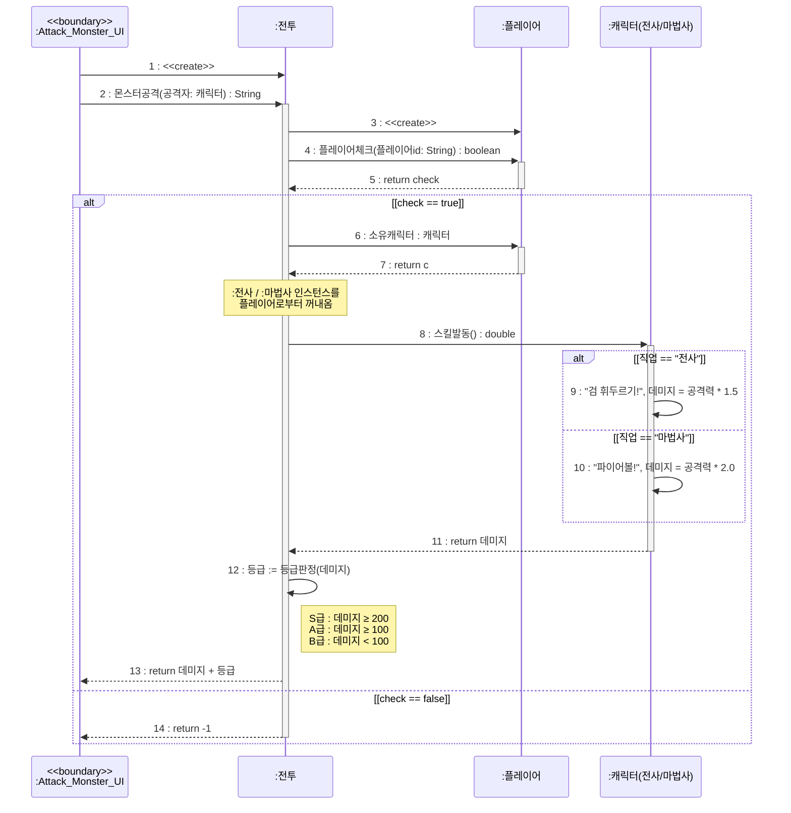

```mermaid
sequenceDiagram
    participant UI as <<boundary>><br/>:Attack_Monster_UI
    participant B as :전투
    participant P as :플레이어
    participant C as :캐릭터(전사/마법사)

    UI->>B: 1 : <<create>>
    UI->>+B: 2 : 몬스터공격(공격자: 캐릭터) : String
    B->>P: 3 : <<create>>
    B->>+P: 4 : 플레이어체크(플레이어id: String) : boolean
    P-->>-B: 5 : return check

    alt [check == true]
        B->>+P: 6 : 소유캐릭터 : 캐릭터
        P-->>-B: 7 : return c
        Note over B: :전사 / :마법사 인스턴스를<br/>플레이어로부터 꺼내옴
        B->>+C: 8 : 스킬발동() : double
        alt [직업 == "전사"]
            C->>C: 9 : "검 휘두르기!", 데미지 = 공격력 * 1.5
        else [직업 == "마법사"]
            C->>C: 10 : "파이어볼!", 데미지 = 공격력 * 2.0
        end
        C-->>-B: 11 : return 데미지
        B->>B: 12 : 등급 := 등급판정(데미지)
        Note right of B: S급 : 데미지 ≥ 200<br/>A급 : 데미지 ≥ 100<br/>B급 : 데미지 < 100
        B-->>UI: 13 : return 데미지 + 등급
    else [check == false]
        B-->>-UI: 14 : return -1
    end
```