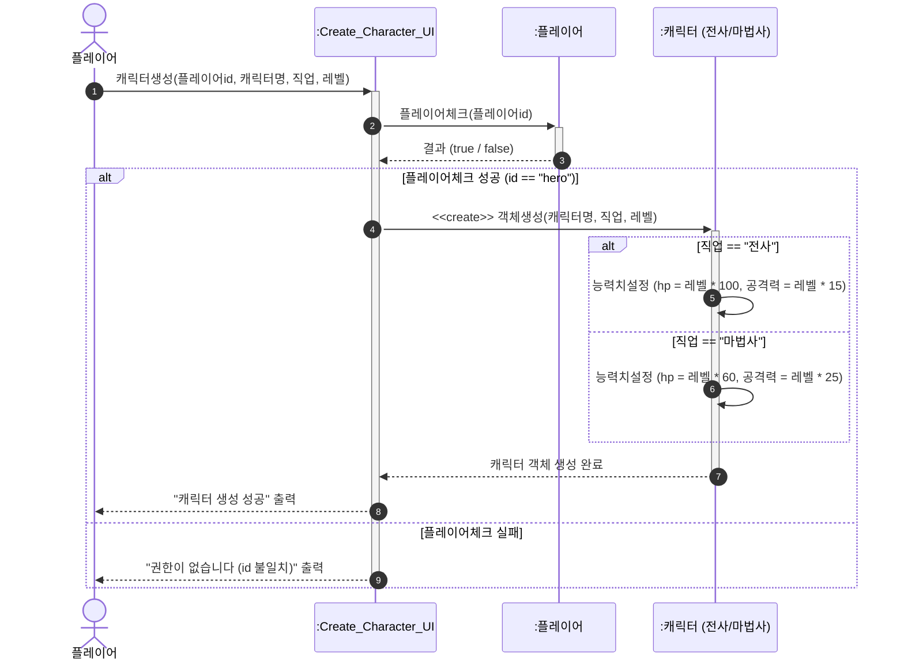

```mermaid
sequenceDiagram
    autonumber
    actor U as 플레이어
    participant UI as :Create_Character_UI
    participant P as :플레이어
    participant C as :캐릭터 (전사/마법사)

    U->>+UI: 캐릭터생성(플레이어id, 캐릭터명, 직업, 레벨)
    UI->>+P: 플레이어체크(플레이어id)
    P-->>-UI: 결과 (true / false)

    alt 플레이어체크 성공 (id == "hero")
        UI->>+C: <<create>> 객체생성(캐릭터명, 직업, 레벨)
        alt 직업 == "전사"
            C->>C: 능력치설정 (hp = 레벨 * 100, 공격력 = 레벨 * 15)
        else 직업 == "마법사"
            C->>C: 능력치설정 (hp = 레벨 * 60, 공격력 = 레벨 * 25)
        end
        C-->>-UI: 캐릭터 객체 생성 완료
        UI-->>U: "캐릭터 생성 성공" 출력
    else 플레이어체크 실패
        UI-->>-U: "권한이 없습니다 (id 불일치)" 출력
    end
```
