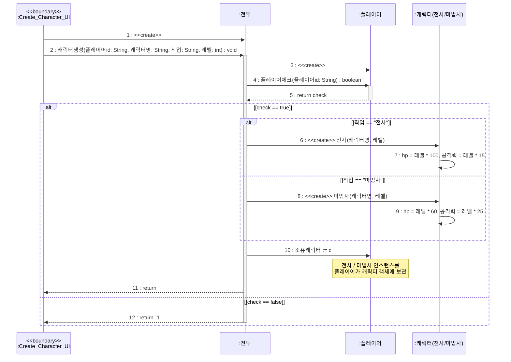

```mermaid
sequenceDiagram
    participant UI as <<boundary>><br/>:Create_Character_UI
    participant B as :전투
    participant P as :플레이어
    participant C as :캐릭터(전사/마법사)

    UI->>B: 1 : <<create>>
    UI->>+B: 2 : 캐릭터생성(플레이어id: String, 캐릭터명: String, 직업: String, 레벨: int) : void
    B->>P: 3 : <<create>>
    B->>+P: 4 : 플레이어체크(플레이어id: String) : boolean
    P-->>-B: 5 : return check

    alt [check == true]
        alt [직업 == "전사"]
            B->>C: 6 : <<create>> 전사(캐릭터명, 레벨)
            C->>C: 7 : hp = 레벨 * 100, 공격력 = 레벨 * 15
        else [직업 == "마법사"]
            B->>C: 8 : <<create>> 마법사(캐릭터명, 레벨)
            C->>C: 9 : hp = 레벨 * 60, 공격력 = 레벨 * 25
        end
        B->>P: 10 : 소유캐릭터 := c
        Note over P: 전사 / 마법사 인스턴스를<br/>플레이어가 캐릭터 객체에 보관
        B-->>UI: 11 : return
    else [check == false]
        B-->>-UI: 12 : return -1
    end
```